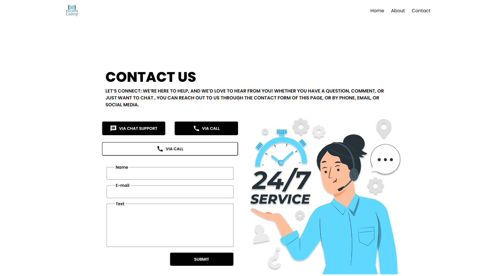

# Figma To React Project



## How to run this :

1. Clone this git repo
   ```console
    git clone https://github.com/dev-sujan/contact-us-page.git
   ```
2. Go to the project directory
   ```console
   cd contact-us-page
   ```
3. Install projec dependencies
   ```console
   npm install
   ```
4. Run it
   ```console
    npm run dev
   ```
   **Or**
   ```console
   yarn dev
   ```
5. Open the localhost link on the browser
   ```console
   http://localhost:5173/
   ```

---

## Conntact Us Page Design


---

## Figma Design link

[Figma Link](https://www.figma.com/file/sQ7YR00sm3Tiu2P50Lasmd/Figma-to-React?type=design&node-id=2%3A5&t=XyQhsLg2YcnFRRXK-1)

